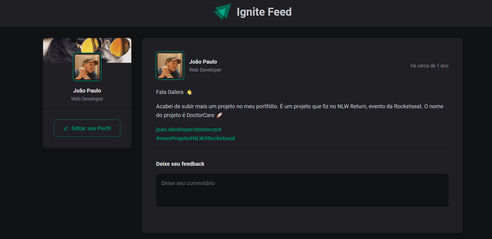

# Feed App

<p align="center">
  <a href="#sobre">Sobre</a> -
  <a href="#tech">Tecnologias</a> -
  <a href="#pre">Pré Requisitos</a> -
  <a href="#author">Autor</a>
</p>


<h1 id='sobre'>Sobre</h1>

Aplicativo criado na introdução do curso de React-JS da Rocketseat.
Template gerado com o vite, código em Typescript e estilização com CSS.



<h1 id='tech'>Tecnologias</h1>

- React JS
- Typescript
- CSS
- Eslint

- Lib - date-fns
- Lib - phosphor-react


<h1 id='pre'>Pré requisitos </h1>

### Antes de rodar você precisar ter instalado na sua máquina as seguintes ferramentas:

1. Git
2. Node JS
3. Yarn

```bash
#Clone esse repositório
$ git clone https://github.com/joaofreitas91/react-js-feed-app.git

#Entre na pasta
$ cd react-js-feed-app

#Instale as dependências 
$ yarn

#Execute a aplicação em modo de desenvolvimento
$ yarn run dev

#Se você não estiver com nenhum projeto rodando no momento, 
#o servidor irá iniciar na porta 3000 - acesse http://localhost:3000

```
<h1 id='author'>Autor</h1>

## Olá, 👋

Feito com 💜 por João Paulo 👋 [Visite meu linkedin](https://www.linkedin.com/in/joaopfreitas91/)
